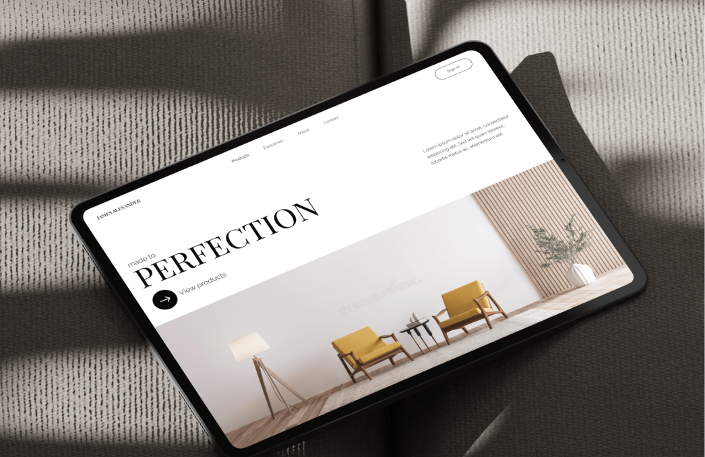

# James Alexander
[View on GitHub Pages](https://mrctemplin.github.io/jamesalexander_website)



## Overview
Design and develop a static homepage for a furniture company. 

This is my second small website project, turning a design prototype from Figma into HTML and CSS.

## Installation
To clone and run this project locally, you'll need [Git](https://gitforwindows.org/) installed on your computer.

**From the command line:**

```bash
git clone https://github.com/mrctemplin/jamesalexander_website.git
```